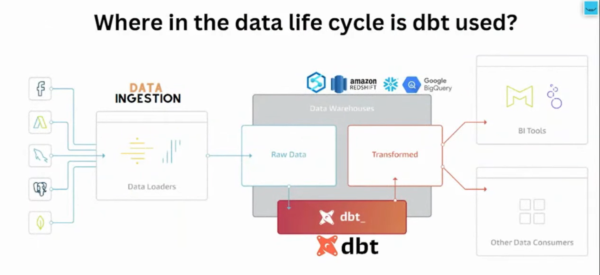

  

## The Evolution of Data Transformation: Why dbt Was Born
In the early days of modern data work, teams relied heavily on traditional ETL (Extract, Transform, Load) tools like Informatica, Talend, and SSIS to prepare data for analytics. These tools were built for an older world — one where data pipelines were maintained by a small group of data engineers, often running on-premises, and transformations were tightly coupled with extraction and loading processes.

As the shift to the cloud data warehouse accelerated — with platforms like Snowflake, BigQuery, and Redshift becoming mainstream — the analytics landscape began to change. More and more, data was being loaded in its raw form into these warehouses by tools like Fivetran and Stitch. What teams needed was a new way to transform this raw data into clean, analysis-ready datasets inside the warehouse itself. But the tooling hadn’t caught up.

Most teams at that time were cobbling together solutions using custom SQL scripts, stored procedures, cron jobs, and Airflow DAGs. While these approaches technically worked, they came with major pain points. SQL scripts were scattered and lacked structure. There was no standard way to organize models, manage dependencies, or even document what each script did. Testing was manual, if it happened at all. Collaboration was difficult, and changes were risky due to the lack of version control or proper CI/CD processes. In short, data transformations were messy, brittle, and hard to scale.

This is the environment that gave rise to dbt — the Data Build Tool. Built originally by analysts for analysts, dbt reimagined data transformation as a process that should follow the same principles and practices as modern software development. Instead of building complex ETL pipelines outside the warehouse, dbt focuses entirely on the "T" in ELT — allowing users to write SQL SELECT statements to define models, which dbt then compiles into materialized tables or views inside the data warehouse.

dbt brought with it a new philosophy: that analytics is engineering. It treats SQL code as software, complete with modular structure, version control, automated testing, and documentation. With dbt, data teams can now build reliable, maintainable data models using just SQL — no Python or Java needed. It also introduces a powerful way to define dependencies between models using the ref() function, enabling dbt to understand and manage the correct order in which data models should be built.

One of the most transformative aspects of dbt is its built-in testing and documentation. Users can define simple, declarative tests (like checking for null values, uniqueness, or referential integrity), and dbt will automatically run these tests every time models are built. This gives teams confidence in the quality of their data. It also automatically generates documentation — complete with lineage graphs — making it easier for teams to understand and trust the data they’re working with.

As dbt matured, it introduced support for CI/CD workflows, making it possible to validate code changes before they affect production. Teams can now collaborate using Git, submit pull requests for SQL model updates, and enforce quality gates just like any modern software project. The release of dbt Cloud, a managed version of the tool, added features like a web-based IDE, job scheduling, and more accessible collaboration for non-technical users.

The impact of dbt has been significant. It has empowered data analysts to build complex transformation pipelines without relying on data engineers, improved the overall quality and reliability of data products, and enabled scalable, transparent workflows across growing data teams. Today, dbt is a cornerstone of the modern data stack, used by thousands of companies to turn raw data into trusted, actionable insights.

In essence, dbt transformed how we transform data.
 
 

## What Is dbt (Data Build Tool)?
dbt, short for Data Build Tool, is a modern tool that helps data teams transform raw data into clean, trusted data models—all inside the data warehouse and using only SQL.

Imagine your company is collecting data from many sources: sales systems, websites, customer support tools, etc. This raw data lands in your data warehouse, but it’s messy, inconsistent, and hard to use for reporting or decision-making. That’s where dbt comes in.

  

With dbt, data analysts and engineers can take that raw data and write simple SQL queries that define how it should be cleaned, joined, filtered, and organized. Each of these queries becomes a "model"—essentially a blueprint for a table or view. dbt then builds these models for you, layer by layer, automatically figuring out which ones depend on others and in what order they should run.

But dbt doesn’t stop there. It helps ensure your data is accurate by letting you write tests—like checking that there are no duplicate customer IDs, or that no important columns are missing values. It also automatically generates documentation, so anyone in the company can explore the data and understand where it came from and how it was built.

One of the most powerful ideas behind dbt is that it treats data work like software development. You store your dbt code in Git, make changes through pull requests, run tests before deploying, and collaborate with your team—just like software engineers do.

In short, dbt makes data transformations:

Modular (split into small, reusable pieces)

Testable (so you catch errors early)

Documented (so everyone understands the logic)

Reproducible and automated (so it's easy to rebuild and scale)

It has become the go-to tool for modern data teams who want to build trustworthy data pipelines that are easy to maintain, collaborate on, and grow with.

Here’s a clear and concise explanation of the **key features of dbt (Data Build Tool)**, written in a narrative format:
 
 

## **Features of dbt**

dbt brings structure, automation, and best practices to the way data teams transform data. It turns a traditionally messy, manual process into a clean, reliable system that behaves like modern software development. Here are the most important features that make dbt so powerful:

---

### **1. SQL-Based Transformations**

At its core, dbt lets you write **SELECT statements** to define how raw data should be transformed into clean, analysis-ready tables. You don’t need to write complicated ETL logic or use unfamiliar programming languages just SQL. dbt takes care of turning your queries into actual models (tables or views) in your data warehouse.

---

### **2. Dependency Management with `ref()`**

dbt understands how your models depend on one another. Using the `ref()` function, you can link models together, and dbt will build them in the correct order automatically. This makes your transformations modular and easy to maintain.

For example, if one model depends on customer data and another on orders, dbt knows to build the customer model first.

---

### **3. Built-in Testing**

With dbt, you can write **automated tests** for your data to catch problems early. These tests can check for things like:

* No missing values in key columns
* No duplicate entries
* Valid relationships between tables

This ensures that your data is reliable and trustworthy before anyone starts using it in dashboards or reports.

---

### **4. Documentation and Lineage Graphs**

dbt can **automatically generate documentation** for your models. You can add descriptions for columns, models, and sources, and dbt creates a web-based interface where anyone can explore how data flows through your system.

The built-in **lineage graph** visually shows how all your models are connected, making it easy to understand the structure of your data.

---

### **5. Modular and Reusable Code**

dbt encourages you to write small, reusable models instead of giant SQL scripts. This makes your codebase easier to read, debug, and scale over time. You can also use **Jinja templating** to add logic and reuse code more efficiently.

---

### **6. Git Integration and CI/CD**

Because dbt projects are just code files, you can version them with Git, review changes through pull requests, and deploy them safely using CI/CD tools. This brings the reliability of software engineering workflows to data work.

---

### **7. Snapshots for Slowly Changing Data**

dbt can track changes in your data over time using a feature called **snapshots**. This is useful for analyzing how records (like customer profiles or subscription statuses) evolve, even if the source system doesn’t store historical versions.

---

### **8. Seed Data Loading**

If you have static or small datasets (like lookup tables), you can include them as **CSV files** in your dbt project. dbt will load them into your warehouse automatically, making them easy to use in models.

---

### **9. Environment Management**

dbt supports multiple **environments** (like dev, staging, and production), allowing you to safely test changes before promoting them. This reduces the risk of breaking dashboards or downstream systems.

---

### **10. Scheduler and UI (dbt Cloud only)**

If you’re using **dbt Cloud**, you get additional features like a **job scheduler**, a **browser-based IDE**, and **team collaboration tools**. This makes it even easier for non-engineering team members to work with dbt.

---

### **In Summary**

dbt’s features make it more than just a transformation tool—it’s a complete framework for building **trustworthy, maintainable, and scalable data pipelines**. It empowers data teams to move faster with confidence, and it brings the rigor of software development into the world of analytics.

Let me know if you'd like a visual diagram or bullet-style version as well!
